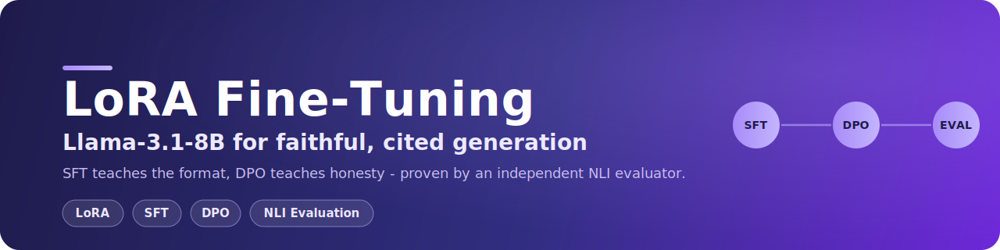
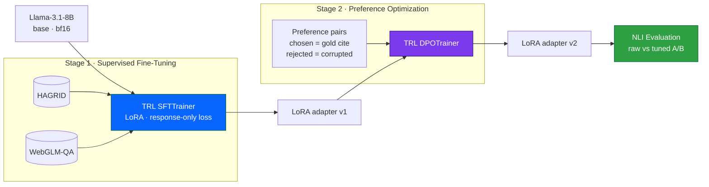

<div align="center">



<br/>

### Getting an open 8B model to cite its sources honestly(no blind citations, cite faithfully) — LoRA, SFT, then DPO — and actually measuring whether it worked.

The model writes inline `[n]` citations after fine-tuning. An NLI attribution system then checks those citations, so "did it improve?" gets a number instead of a vibe.

<br/>

[](<DEMO_VIDEO_URL>)
&nbsp;

<br/>


</div>

---

## The problem I was solving

Hand an LLM the right documents and it'll *still* cite the wrong one. Or invent a `[4]` that points at nothing. Under any uncertainty, a base model reaches for whatever looks plausible — and a citation in the right format looks plausible whether or not it's true.

So getting the format right is the easy half. The hard half is honesty. This project fine-tunes Llama-3.1-8B in two passes to chase both, and then leans on a separate NLI judge to say whether the second pass actually landed.

=>What SFT will solve? : It will teach model how to cite 'just the format'[SFT is about format]

=>What DPO will solve? : Teaching the model how to cite 'correctly'[DPO is about correctness]

```
   Base Llama-3.1-8B          after SFT                after DPO
   cites whatever       ->    cites in the      ->     cites the source
   looks right                right [n] format         that's really right
```

---

## The recipe



**Stage 1, SFT — learn the shape or format.** Give the model a question and a set of numbered sources, ask for an answer with inline `[n]` citations. Standard TRL `SFTTrainer`, LoRA adapters through PEFT, with response-only loss masking so it's graded on the answer it writes and never on the prompt it was handed.

**Stage 2, DPO — learn to be honest.** Show it two versions of the same answer and let it learn which one it should prefer. The good one (`chosen`) is the gold, correctly-cited answer. The bad one (`rejected`) is that same answer, deliberately broken. Concretely, the corruptions in [`build_dpo_pairs.py`](colab_pipeline/training/data/build_dpo_pairs.py) do one of three things:

- point a citation at the wrong document,
- delete a citation that should be there, or
- swap one named entity for another the answer already mentions — so "Mbappé scored" might flip to "Messi scored": same shape, wrong fact.

That third one is the interesting case. The answer still *reads* perfectly. DPO is what teaches the model to push away from it.

---

## The data, and what I left out

| Stage | What it trains on | Why |
|---|---|---|
| SFT | `HAGRID` + `WebGLM-QA` | both ship gold answers with inline citations — the exact target |
| DPO | pairs built from the SFT gold | `chosen` is faithful, `rejected` is corrupted (swap / drop / noun) |
| NLI head | `WICE` · `nli_fever` · `ANLI` · `VitaminC` | making a robust judge for entailment |


---

## Training setup and why each choice:

| Knob | Value | The reason |
|---|---|---|
| Method | LoRA (PEFT) | only the adapters train and ship — cheap to store, cheap to swap |
| Precision | `bfloat16` | stable, and the A100 has room without QLoRA |
| Batch size | `1` | what fits the 8B base on one GPU before it OOMs |
| Epochs | `1` each | more was worse — see the note below |
| Loss masking | response-only | grade the answer, never the prompt |
| Checkpointing | fresh every run | no stale `checkpoint-*`; it saves the final adapter and nothing else |

---

## Did it work? The evaluation

Here's the test I trust: run every held-out query through the full live-web pipeline twice — raw base model, then tuned — with the *same* retrieved chunks and the *same* NLI scorer each time. The adapter is the only variable. And the judge is a separate `DeBERTa-v3-NLI` model (`trust = P(entail) x sigma(CE)`, cutoff at 0.75), not the model marking its own homework.

| Metric | Raw base | Tuned (SFT + DPO) | Change |
|---|:---:|:---:|:---:|
| Citation precision | 0.075 | **0.142** | about 1.9x |
| Citation recall | 0.444 | **0.476** | up |
| Citation F1 | 0.070 | **0.162** | about 2.3x |

```text
Citation Precision   raw  ####................  0.075
                   tuned  ########............  0.142   ->  ~1.9x

Citation F1          raw  ###.................  0.070
                   tuned  #########...........  0.162   ->  ~2.3x
```

So: citation F1 roughly doubled. I'm reporting all three rows on purpose — precision, recall, F1 — instead of fishing out the one number that flatters the run. The gains are modest in absolute terms and the NLI judge is strict by design, but they're consistent across the whole split, which is the part that counts.

# Limitation Of the evaluation:
```
My derived eval set contains only 16 queries and 16 queries is small eval set. The numbers (precision 0.075→0.142, F1 0.070→0.162) are a real, controlled signal — same retrieval, same NLI judge, only the adapter changes — but they're directional, not a statistically robust benchmark.
```
---

## Run it yourself

```bash
# 0. HuggingFace token in Colab Secrets as HF_TOKEN; you'll want an A100 to train.

# Build the data
python -m training.data.normalize          # HAGRID + WebGLM-QA -> SFT/test
python -m training.data.build_dpo_pairs    # the chosen/rejected pairs

# Fine-tune  (LoRA · bf16 · bs 1 · grad-accum 8 · 1 epoch · fresh each run)
python -m training.sft_generator           # Stage 1
python -m training.dpo_generator           # Stage 2
python -m training.train_nli_head          # calibrate the judge

# Score raw vs tuned over the entire test set
python -m eval.harness --dual --queries data/test/sft.jsonl --out docs/eval_results.md
```

Or skip the command line entirely — open [`run_full_pipeline.ipynb`](colab_pipeline/run_full_pipeline.ipynb) and run sections 2 through 4.

---

## Where the training code lives

```
colab_pipeline/
├── training/
│   ├── sft_generator.py          Stage 1 — TRL SFT (LoRA, response-only loss)
│   ├── dpo_generator.py          Stage 2 — TRL DPO
│   ├── train_nli_head.py         temperature-scaling calibration
│   ├── train_rewriter.py         the query-rewriter adapter
│   ├── checkpoint_utils.py       fresh-run logic + Drive path handling
│   └── data/
│       ├── normalize.py          HAGRID + WebGLM-QA into one schema
│       └── build_dpo_pairs.py    how the chosen/rejected pairs get made
├── eval/harness.py               raw-vs-tuned A/B (precision / recall / F1)
├── app/attribution/scorer.py     the NLI trust score
└── config/config.yaml            LoRA, model, and threshold knobs
```

---

## This is one piece of something bigger

The model trained here is the generator inside **X-RAG**, a full explainable-RAG engine — live web retrieval, a LangGraph retry loop, hybrid FAISS search, the works.

> The whole system: [**X-RAG — Explainable RAG with Llama-3.1-8B**](https://github.com/SKT799/XRAG-Explainable-RAG-Llama8B)

<div align="center">

**If it helped, a star is appreciated.**

</div>
